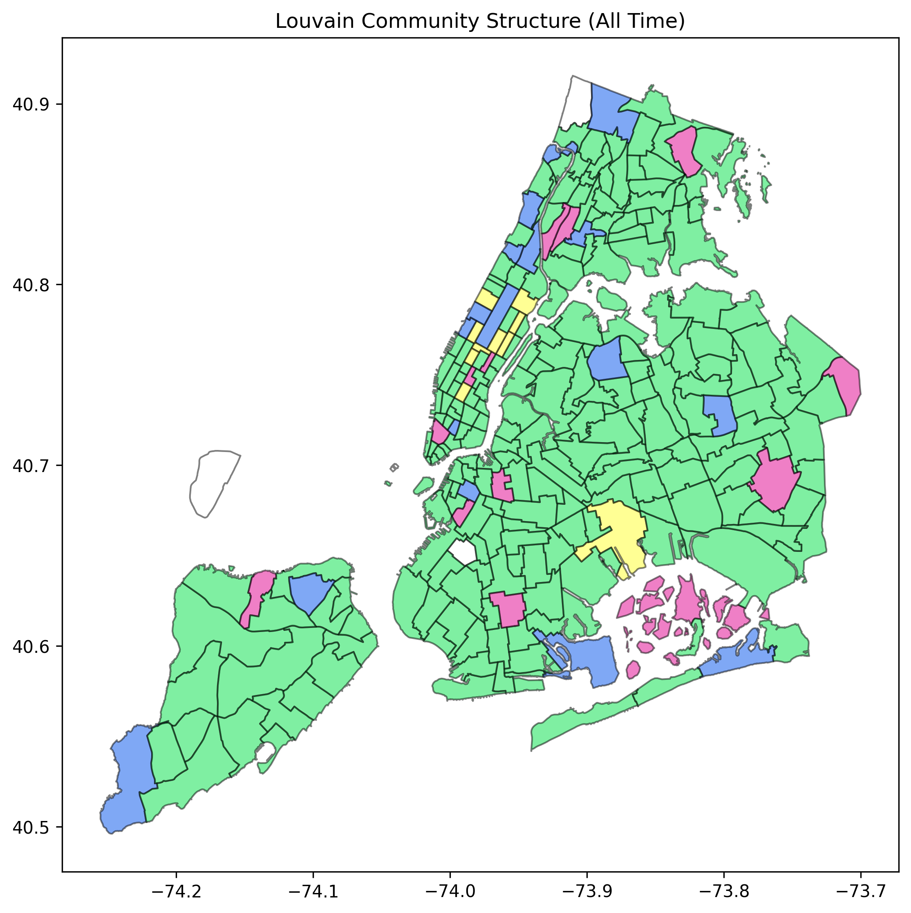

Project 4 for UCLA's ECE232E: Large Scale Social and Complex Networks

Part of the project focused on analyzing Taxi data from NYC found [here](https://www1.nyc.gov/site/tlc/about/tlc-trip-record-data.page). The analysis used all trip data from January 2020.

Some interesting plots are below with more detail found in the submission (`P4.pdf`).

[Animated community structure using the Louvain algorithm](https://i.imgur.com/7RQJZTn.gif)

[Animated net flow and degree distribution](https://i.imgur.com/XpFaj8c.gif)

